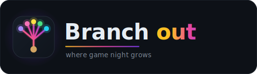

<p align="center">
  
</p>

<p align="center"><strong>where game night grows.</strong></p>

<p align="center">
  <a href="https://github.com/rogueoak/branchout/actions/workflows/ci.yml">
    
  </a>
  
</p>

## What this is

Branch Out Games is a platform for online shared games - mostly party games you play
together, with a few solo ones. Get friends into a game in seconds, and keep it fair and
social.

This repo is the monorepo for the whole platform. Everything is TypeScript, on pnpm workspaces
and Turborepo.

```
apps/
  web            Next.js - marketing site + browser game client
  control-plane  Fastify - accounts, rooms, billing (system of record)
  game-engine    Fastify + WebSocket - runs games, holds live state
packages/
  protocol         shared protocol types + the WebSocket transport adapter
  service-runtime  shared Fastify-service helpers (env parsing, Redis client)
  config           shared tsconfig, ESLint, Prettier
infra/
  docker-compose.yml   Postgres + Redis + the three apps, end to end
```

## Quick start

You need Node 22+ and pnpm 11. Docker is only needed to run the whole system at once.

```sh
git clone git@github.com:rogueoak/branchout.git
cd branchout
pnpm install       # set up the workspace
pnpm build         # build every package and app
pnpm lint          # lint everything
pnpm test          # run every test
```

Run the whole system with Postgres, Redis, and all three apps wired together:

```sh
cp infra/.env.example infra/.env
docker compose -f infra/docker-compose.yml up --build
```

Then:

- web: http://localhost:3000
- control-plane health: http://localhost:4000/health
- game-engine health: http://localhost:4001/health

Working on one app? Run it standalone with hot reload (point it at a local or compose
Postgres/Redis first):

```sh
pnpm --filter @branchout/web dev
pnpm --filter @branchout/control-plane dev
pnpm --filter @branchout/game-engine dev
```

### Play on your phone (same WiFi)

Liar Liar is a phone-party game: everyone plays on their own phone against a shared viewer screen.
To play (or test) that locally, run the stack so other devices on the same network can reach it:

```sh
pnpm build      # once, so the packages the recipe uses are built
pnpm dev:lan    # detects your LAN IP, wires it in, and brings up the dev stack
```

It prints the URL to open on phones (e.g. `http://192.168.1.42:3000`). It points the browser's
control-plane and engine URLs at your machine's LAN IP, allows that origin through CORS, and relaxes
the session cookie for plain-http dev - all dev-only (production stays same-origin behind the proxy).
The lobby shows the same connect URL and the room code so others can join. (Everyone must be on the
same WiFi; a guest network that isolates clients will not work.)

## What's new

`0.0.0` - the monorepo scaffold (spec `0001`): the three apps, shared `config` and `protocol`
packages, CI, and a docker-compose that runs the whole system locally. No feature logic yet.

## Documentation

- `docs/overview/` - living docs: project, features, architecture, learnings.
- `docs/specs/` - the spec roadmap. Start at `docs/specs/README.md`.
- `docs/rules/` and `docs/spectra/` - how changes ship (Trellis + Spectra).
- `CONTRIBUTING.md` - how to work in this repo.

## License

MIT. See [LICENSE](LICENSE).
